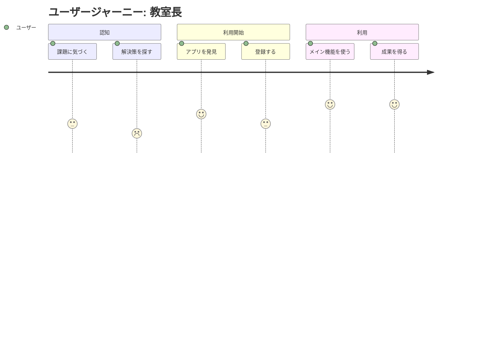
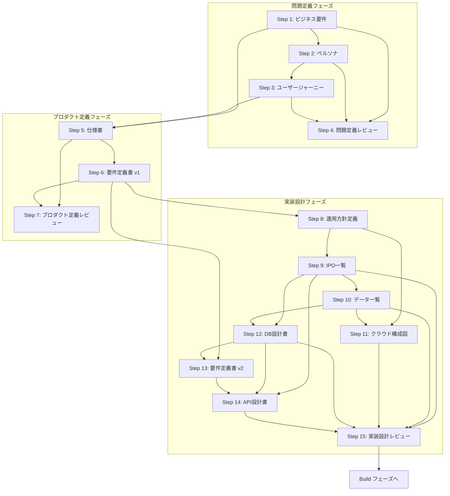

# R2B Design フェーズ 完全ガイド

## 概要

本ドキュメントは、r2b-design-sprint3 スキルで定義された15ステップの設計プロセスを詳細に解説する。
各ステップの目的、検討事項、成果物、依存関係を網羅的に記載する。

---

## 全体構成

### フェーズ構成

| フェーズ | ステップ | 目的 |
|---------|---------|------|
| **問題定義フェーズ** | Step 1〜4 | 解決すべき問題とユーザーを明確化 |
| **プロダクト定義フェーズ** | Step 5〜7 | 画面・機能・要件を定義 |
| **実装設計フェーズ** | Step 8〜15 | 技術設計・API・DB設計 |

### ステップ一覧

| # | ステップ名 | コマンド | 成果物 | 依存 |
|---|-----------|---------|--------|------|
| 1 | ビジネス要件 | `/design-business` | `business-requirements/business-requirements.md` | なし |
| 2 | ペルソナ | `/design-persona` | `personas/{persona-name}.md` | Step 1 |
| 3 | ユーザージャーニー | `/design-journey` | `journey/journey.md` | Step 2 |
| 4 | 問題定義レビュー | `/design-problem-check` | （レビューのみ） | Step 1-3 |
| 5 | 仕様書 | `/design-spec` | `specifications/{page-name}.md`, `specifications/flow.md` | Step 1, 3 |
| 6 | 要件定義書 v1 | `/design-requirements` | `requirements-v1/{page-name}.md` | Step 5 |
| 7 | プロダクト定義レビュー | `/design-product-check` | （レビューのみ） | Step 5-6 |
| 8 | 運用方針定義 | `/design-operations` | `operations/operations-policy.md` | Step 6 |
| 9 | IPO一覧 | `/design-ipo` | `ipo/ipo.md` | Step 8 |
| 10 | データ一覧 | `/design-data` | `data/data-list.md` | Step 9 |
| 11 | クラウド構成図 | `/design-cloud` | `cloud/cloud-diagram.drawio` | Step 8, 10 |
| 12 | DB設計書 | `/design-db` | `database/database-design.md` | Step 9, 10 |
| 13 | 要件定義書 v2 | `/design-requirements-v2` | `requirements-v2/{page-name}.md` | Step 6, 12 |
| 14 | API設計書 | `/design-api` | `api/api-design.md` | Step 9, 12, 13 |
| 15 | 実装設計レビュー | `/design-implementation-check` | （レビューのみ） | Step 9-14 |
| - | ワイヤーフレーム | `/design-wireframe` | `wireframe/index.html` | なし（任意） |

---

## 問題定義フェーズ（Step 1〜4）

### Step 1: ビジネス要件定義

**コマンド**: `/design-business`

**目的**:
プロジェクトの背景にある課題を明確にし、解決すべき問題と期待される成果を定義する。
全ての設計の出発点となるドキュメントを生成する。

**検討事項**:

| カテゴリ | 検討項目 | 質問例 |
|---------|---------|--------|
| 背景 | プロジェクト発足の経緯 | このプロジェクトはなぜ立ち上がりましたか？ |
| 背景 | 現状の課題・不便さ | 現在、どのような課題や不便さがありますか？ |
| 背景 | ビジネスへの影響 | それがビジネスにどのような影響を与えていますか？ |
| 課題 | 解決したい課題 | 今、解決したい課題は何ですか？（複数可） |
| 課題 | 影響度と優先度 | それぞれの課題の影響度と優先度は？ |
| 課題 | 定量的測定 | 定量的に測定できる課題はありますか？ |
| ゴール | 達成したい状態 | このプロジェクト完了時に達成したい状態は？ |
| ゴール | 成功基準 | 成功の基準は何ですか？ |
| ゴール | 中長期ビジョン | 6ヶ月後、1年後はどうなっていたいですか？ |
| 利害関係者 | 利用者 | このプロジェクトの利用者は誰ですか？ |
| 利害関係者 | 期待 | その利用者は何を期待していますか？ |
| 利害関係者 | その他関係者 | 他に関係者はいますか？ |

**成果物**:
```
docs/requirements/business-requirements/business-requirements.md
```

**成果物の構成**:
- 背景
- 課題一覧（課題名、説明、影響度、優先度）
- ゴール
- 成功基準・KPI
- 利害関係者一覧（利害関係者、役割、期待）

**制約**:
- 技術的な解決方法には言及しない
- ユーザーの言葉をそのまま使う
- 定量的な目標があれば具体的な数値を記入

---

### Step 2: ペルソナ定義

**コマンド**: `/design-persona`

**目的**:
ビジネス要件で特定した利害関係者を具体的なペルソナとして詳細に定義する。
各ペルソナの特性・目標・課題を把握し、後続設計に一貫性をもたらす。

**前提条件**:
- `business-requirements/business-requirements.md` が作成済みであること

**検討事項**:

| カテゴリ | 検討項目 | 質問例 |
|---------|---------|--------|
| ペルソナ選定 | メインユーザー | 利害関係者の中で、メインのユーザーは誰ですか？ |
| ペルソナ選定 | 副次的ユーザー | 副次的なユーザー層はいますか？ |
| ペルソナ選定 | ペルソナ数 | ペルソナは何人必要だと思いますか？（通常2〜4人） |
| ユーザー属性 | 基本情報 | このペルソナの名前と年代は？ |
| ユーザー属性 | 職業・部門 | 職業・部門は？ |
| ユーザー属性 | 技術スキル | 技術スキルレベルは？ |
| ユーザー属性 | 環境 | 勤務地・物理的な環境は？ |
| 目標・ゴール | 最終目標 | このペルソナが最終的に達成したいことは？ |
| 目標・ゴール | 仕事上の目標 | 仕事上の目標は？ |
| 目標・ゴール | 価値観 | 個人的な価値観は？ |
| 課題・痛点 | 現在の課題 | 現在、どんな課題を抱えていますか？ |
| 課題・痛点 | 時間的コスト | 課題解決に何時間費やしていますか？ |
| 課題・痛点 | ストレス | 他にストレスを感じていることは？ |
| 利用状況 | 利用シーン | このアプリをどのような場面で使いますか？ |
| 利用状況 | 頻度 | 使用頻度は？ |
| 利用状況 | 利用時間 | 一度の使用でどのくらいの時間を費やしますか？ |

**成果物**:
```
docs/requirements/personas/{persona-name}.md
```
（ペルソナごとに複数ファイル）

**成果物の構成**（各ペルソナファイル）:
- ペルソナ名・年代
- ユーザー属性（職業、技術スキル、環境）
- 目標・ゴール
- 課題・痛点
- 利用状況
- ペルソナの心情（1〜2文）

**Tips**:
- ペルソナは実データに基づくことが理想的
- ペルソナ間で矛盾がないか確認
- 典型的でない例外ユーザーも考慮する価値あり

---

### Step 3: ユーザージャーニー定義

**コマンド**: `/design-journey`

**目的**:
ペルソナから「誰が、どんな状況で、何をしたいか」という行動フローを整理し、ユーザージャーニーマップを作成する。
後続の設計段階（ページ定義・機能設計）の基礎となる。

**前提条件**:
- `personas/` フォルダ内に各ペルソナファイルが存在すること

**検討事項**:

| カテゴリ | 検討項目 | 質問例 |
|---------|---------|--------|
| ペルソナ選定 | 対象ペルソナ | どのペルソナのジャーニーを作成しますか？ |
| 行動フロー | 最初のアクション | 最初にペルソナが行うアクションは何ですか？ |
| 行動フロー | ゴールまでの流れ | その後、どんな流れでゴールに到達しますか？ |
| 感情・期待 | 各ステップの感情 | 各ステップでユーザーの感情や期待は？ |

**成果物**:
```
docs/requirements/journey/journey.md
```

**成果物の構成**:
- 対象ペルソナ
- ジャーニーマップ（Mermaid journey図）
- 各段階の説明
  - 段階名
  - ユーザーの行動
  - 感情スコア（1-5、5が最もポジティブ）
  - タッチポイント

**Mermaid journey図の例**:


**制約**:
- ユーザーの言葉をそのまま使い、技術用語に置き換えない
- 感情スコアは1-5で表現
- 複雑になりすぎないよう、メインフローに絞る

---

### Step 4: 問題定義レビュー

**コマンド**: `/design-problem-check`

**目的**:
ビジネス要件・ペルソナ・ユーザージャーニーの3つのドキュメントを総括的にレビューし、矛盾・不足・粒度の問題を洗い出す。

**前提条件**:
- `business-requirements/business-requirements.md` が作成済み
- `personas/` 配下にペルソナファイルが存在
- `journey/journey.md` が作成済み

**検討事項**:

#### 個別ドキュメントのチェック

| 対象 | チェック観点 | 確認内容 |
|------|------------|---------|
| ビジネス要件 | 明確性 | 解決したい課題・目的が具体的に書かれているか |
| ビジネス要件 | 測定可能性 | 成功基準・KPIが定義されているか |
| ビジネス要件 | スコープ | 対象範囲が明確か（何をやらないかも含む） |
| ビジネス要件 | 粒度 | 抽象すぎて実装に落とせない要件がないか |
| ペルソナ | 網羅性 | 想定されるユーザー像がすべて定義されているか |
| ペルソナ | 具体性 | 行動・課題・目標が具体的に描かれているか |
| ペルソナ | 差別化 | 複数ペルソナが互いに十分に差別化されているか |
| ペルソナ | 整合性 | ビジネス要件で想定しているユーザーと一致しているか |
| ジャーニー | ペルソナ対応 | 定義したペルソナのジャーニーが網羅されているか |
| ジャーニー | 連続性 | ユーザー行動のステップに飛躍・欠落がないか |
| ジャーニー | 課題・感情 | 各ステップでの課題・感情が記述されているか |
| ジャーニー | タッチポイント | システムとのタッチポイントが明確か |

#### 横断的なチェック

| 関係 | 確認内容 |
|------|---------|
| ビジネス要件 ↔ ペルソナ | 解決したい課題とペルソナの課題が対応しているか |
| ペルソナ ↔ ジャーニー | 各ペルソナのジャーニーが描かれているか |
| ビジネス要件 ↔ ジャーニー | ジャーニーの中でビジネス要件が達成されているか |
| 全体の一貫性 | 3つのドキュメントを通じて問題のストーリーが一貫しているか |

**成果物**:
（レビュー結果のみ、ファイル生成なし）

**レビュー結果フォーマット**:
```
## レビュー結果

### ❌ 矛盾・不整合
（例: ペルソナ A の課題がビジネス要件に記載がない）

### ⚠️ 不足・曖昧
（例: ユーザージャーニーの「購入後」のステップが未定義）

### 💡 粒度の提案
（例: ビジネス要件の「使いやすい UI」はより具体的な基準に分解できる）

### ✅ 問題なし
（問題がない項目を列挙）
```

**重要**:
- このステップでは修正を行わない
- ユーザーと問題を共有し、ユーザー自身が編集・修正を行う
- 問題がなければ次のフェーズへの移行を促す

---

## プロダクト定義フェーズ（Step 5〜7）

### Step 5: 仕様書作成

**コマンド**: `/design-spec`

**目的**:
ユーザージャーニーとビジネス要件から必要な画面を洗い出し、各画面の詳細仕様を定義し、画面間の遷移関係を整理する。

**前提条件**:
- `business-requirements/business-requirements.md` が作成済み
- `journey/journey.md` が作成済み

**検討事項**:

#### 画面リストアップ

| 検討項目 | 質問例 |
|---------|--------|
| 画面の洗い出し | ジャーニーの各段階に対応する画面はありますか？ |
| 追加画面 | ビジネス要件の機能も画面として必要ですか？ |
| 画面数 | 通常5〜15個のPageを確定 |

#### 各Page毎の詳細仕様

| カテゴリ | 検討項目 | 質問例 |
|---------|---------|--------|
| Page目的 | ユーザーの行動 | このPageでユーザーは何をしますか？ |
| Page目的 | 達成目的 | このPageが達成すべき目的は？ |
| 機能一覧 | 実行可能な操作 | このPage上で実行できる操作は何ですか？ |
| UI要素 | 必要なUI | このPageにはどんなUI要素が必要ですか？ |
| UI要素 | 入力・表示 | 入力フィールド、ボタン、テーブル、グラフなど |
| 機能-UI対応 | 対応関係 | 各機能はどのUI要素と対応していますか？ |
| 機能-UI対応 | 処理 | どのUI要素を操作すると、どんな処理が起きますか？ |

#### 画面遷移の整理

| 検討項目 | 内容 |
|---------|------|
| ページ関係表 | 各ページの遷移元・遷移先・遷移トリガー |
| 遷移図 | Mermaidフローチャートで可視化 |

**成果物**:
```
docs/requirements/specifications/{page-name}.md  （Page毎、複数ファイル）
docs/requirements/specifications/flow.md         （画面遷移図・ページリスト）
```

**仕様書（Page毎）の構成**:
- ページID（P001, P002...）
- ページ名
- 目的・役割
- 機能一覧（機能名、説明）
- UI要素（要素名、種類、説明、配置）
- 機能とUIの結びつき

**flow.md の構成**:
- ページリスト（ID、名前、目的、遷移元、遷移先）
- ページ関係表
- 遷移図（Mermaid）

**Tips**:
- Pageは「URL単位」または「モーダル・タブの隔たり」で区切ることが多い
- 画面スクリーンショットやスケッチがあると理想的

---

### Step 6: 要件定義書 v1 作成

**コマンド**: `/design-requirements`

**目的**:
仕様書で定義したPageの機能を、より詳細な要件定義に展開する。
各Page上での機能の入出力（IPO）と、UI要素の状態遷移を明確にする。

**前提条件**:
- `specifications/` フォルダ内に各Page毎のスペックファイルが存在すること

**検討事項**:

| カテゴリ | 検討項目 | 質問例 |
|---------|---------|--------|
| Page目的 | 目的確認 | このPageの目的をもう一度確認しましょう |
| 機能詳細 | 詳細説明 | このPage上の各機能について、詳しく説明してください |
| IPO - Input | 入力 | {機能}を実行するには、ユーザーは何を入力しますか？ |
| IPO - Process | 処理 | その入力を受け取って、システムは何をしますか？ |
| IPO - Output | 出力 | 最終的な出力・結果は何ですか？ |
| UI状態遷移 | 状態 | このPageの各UI要素は、どんな状態を持ちますか？ |
| UI状態遷移 | 変化 | ユーザーの操作に応じて、どう状態が変わりますか？ |

**IPO定義の例**:
```
機能: 顧客検索
Input: 顧客名、メールアドレス
Process: DBで顧客情報を検索、マッチング
Output: 検索結果の顧客一覧表
```

**UI状態の例**:
- ボタン: 「有効」「無効」「ローディング」
- フォーム: 「初期」「入力中」「エラー」「送信中」

**成果物**:
```
docs/requirements/requirements-v1/{page-name}.md  （Page毎、複数ファイル）
```

**成果物の構成**:
- ページID・名前
- Page目的
- 機能詳細（機能名、説明、v1との変更点）
- IPO表（機能、Input、Process、Output）
- UI状態遷移（UI要素、状態一覧、遷移条件）

**Tips**:
- 仕様書と要件定義書は対応関係が重要
- IPO定義は後のDB設計やAPI設計に大きく影響
- 状態遷移はフロントエンド実装効率に直結

---

### Step 7: プロダクト定義レビュー

**コマンド**: `/design-product-check`

**目的**:
仕様書・画面遷移図・要件定義書 v1 を総括的にレビューし、矛盾・不足・粒度の問題を洗い出す。

**前提条件**:
- `specifications/` 配下にスペックファイルが存在
- `specifications/flow.md` が作成済み
- `requirements-v1/` 配下に要件定義書が存在

**検討事項**:

#### 個別ドキュメントのチェック

| 対象 | チェック観点 | 確認内容 |
|------|------------|---------|
| 画面遷移図 | 網羅性 | すべての画面が列挙されているか |
| 画面遷移図 | 連続性 | 画面間の遷移に飛躍・行き止まりがないか |
| 画面遷移図 | 認証状態 | ログイン前・後で表示される画面の区別が明確か |
| 画面遷移図 | 異常系 | エラー画面・例外フローが定義されているか |
| 仕様書 | 目的の明確性 | 各Pageの目的・役割が明確に定義されているか |
| 仕様書 | 機能の網羅性 | そのPageで必要な機能がすべて列挙されているか |
| 仕様書 | UI要素 | ボタン・フォーム・表示項目が具体的に定義されているか |
| 仕様書 | 粒度 | 機能が大きすぎて実装困難でないか |
| 要件定義書v1 | IPOの整合 | Input・Process・Outputが論理的に対応しているか |
| 要件定義書v1 | UI状態遷移 | 各UI要素の状態が定義されているか |
| 要件定義書v1 | バリデーション | 入力値の検証ルールが記載されているか |
| 要件定義書v1 | 権限 | 誰がその機能を使えるかが明記されているか |

#### 横断的なチェック

| 関係 | 確認内容 |
|------|---------|
| flow.md ↔ 仕様書 | すべてのPageの仕様書が存在するか |
| 仕様書 ↔ 要件定義書v1 | 各機能に対応する要件定義が存在するか |
| 要件定義書v1の一貫性 | 複数Page間で同じ用語・概念が矛盾なく使われているか |
| 問題定義との接続 | ユーザージャーニー・ペルソナの課題が解決されているか |

**成果物**:
（レビュー結果のみ、ファイル生成なし）

**重要**:
- 修正はユーザー自身が行う
- エラー系・権限系の要件は抜け落ちやすいので重点的に確認

---

## 実装設計フェーズ（Step 8〜15）

### Step 8: 運用方針定義

**コマンド**: `/design-operations`

**目的**:
プロジェクトの運用方針を定義する。チーム構成・GitHub ブランチ戦略・デプロイ方針・クラウド環境・SLA・可用性・トラフィック予測・IAM・VPC分離・リリースフローを明確にする。

**前提条件**:
- `requirements-v1/` フォルダ内に各Page毎の要件定義書が存在すること

**検討事項**:

#### チーム構成

| 検討項目 | 質問例 |
|---------|--------|
| 人数 | このプロジェクトの開発メンバーは何人ですか？ |
| PM | PM（プロジェクトマネージャー）は誰ですか？ |
| 役割分担 | 役割分担（フロント担当、バック担当、インフラ担当など）を教えてください |

#### GitHub ブランチ戦略

| 検討項目 | 質問例 |
|---------|--------|
| 戦略選択 | どのブランチ戦略を採用しますか？（GitHub Flow / Git Flow / Trunk-based） |
| ブランチ役割 | main / develop / feature ブランチの役割を確認しましょう |
| マージ条件 | PRのマージ条件は何ですか？（レビュー人数、CI通過など） |
| 命名規則 | feature ブランチの命名規則を決めましょう |
| コミット規則 | コミットメッセージの規則はありますか？（Conventional Commits） |

#### デプロイ・インフラ方針

| 検討項目 | 質問例 |
|---------|--------|
| デプロイ有無 | このプロジェクトは本番環境へのデプロイを行いますか？ |
| デプロイ先 | デプロイ先はどこですか？（AWS / GCP / オンプレ） |
| 環境構成 | 何環境を用意しますか？（dev / stg / prod） |
| 主要サービス | 主に使用するサービスは？（ECS / RDS / S3 など） |

#### SLA・可用性（クラウドの場合）

| 検討項目 | 質問例 |
|---------|--------|
| 目標稼働率 | 目標稼働率（SLA）は何%ですか？ |
| フェイルオーバー | 障害時のフェイルオーバーは自動で行いますか？ |
| Auto Scaling | Auto Scaling は必要ですか？ |

#### トラフィック予測（クラウドの場合）

| 検討項目 | 質問例 |
|---------|--------|
| ユーザー数 | 想定ユーザー数（DAU / MAU）はどのくらいですか？ |
| ピーク時 | ピーク時の同時アクセス数の見込みは？ |
| データ転送 | 大きなデータ転送はありますか？ |

#### VPC・ネットワーク分離（クラウドの場合）

| 検討項目 | 質問例 |
|---------|--------|
| VPC分離 | VPCをどう分離しますか？ |
| サブネット | パブリック / プライベートサブネットの構成は？ |
| 環境間通信 | 環境間の通信が必要な場合、VPC Peering を使いますか？ |

#### IAM分離戦略（クラウドの場合）

| 検討項目 | 質問例 |
|---------|--------|
| サービス別IAM | 各サービスに最小権限のIAMロールを個別に作成しますか？ |
| 環境別ポリシー | 開発者のIAMポリシーは環境ごとに分けますか？ |
| CI/CD用IAM | CI/CDパイプライン用の専用IAMロールを作成しますか？ |

#### リリース頻度と承認フロー

| 検討項目 | 質問例 |
|---------|--------|
| 頻度 | リリース頻度はどのくらいですか？ |
| ホットフィックス | 緊急リリースの手順はありますか？ |
| 承認者 | 本番リリースの最終承認者は誰ですか？ |
| 承認タイミング | 承認のタイミングはいつですか？ |
| 通知 | リリース通知は誰に、どのチャンネルで行いますか？ |

**成果物**:
```
docs/requirements/operations/operations-policy.md
```

**成果物の構成**:
- チーム構成（人数、役割）
- ブランチ戦略（戦略、命名規則、マージ条件）
- デプロイ方針（環境構成、主要サービス）
- SLA・可用性（目標稼働率、フェイルオーバー）
- トラフィック予測（ユーザー数、ピーク時）
- VPC・ネットワーク構成
- IAM戦略
- リリースフロー（頻度、承認フロー、通知）

**Tips**:
- SLA 99.9% と 99.99% の差はコストに大きく影響
- VPC分離はセキュリティと運用コストのトレードオフ
- IAMは「最初から最小権限」がセキュリティ事故を防ぎやすい

---

### Step 9: IPO一覧作成

**コマンド**: `/design-ipo`

**目的**:
要件定義書 v1 の各Pageで定義したIPOを集約し、全機能のデータフロー全体を可視化する。
重複・漏れ・矛盾がないことを確認する。

**前提条件**:
- `requirements-v1/` フォルダ内に全Pageの要件定義書が存在すること

**検討事項**:

| カテゴリ | 検討項目 | 質問例 |
|---------|---------|--------|
| IPO集約 | 機能の整理 | 各Pageの要件定義書から、機能とIPOを整理しましょう |
| IPO集約 | 重複排除 | 既存のIPO定義と重複していませんか？ |
| IPO集約 | 新規機能 | 新しく発見した機能はありますか？ |
| データフロー | 連鎖確認 | ある機能のOutputが、別の機能のInputとして使われていますか？ |
| データフロー | 整合性 | そうしたInputとOutputの繋がりは正しいですか？ |
| データフロー | 欠落確認 | 必要なInputなのに、提供する機能がありませんか？ |

**成果物**:
```
docs/requirements/ipo/ipo.md
```

**成果物の構成**:
- 全機能のIPO一覧表（ページ、機能名、Input、Process、Output、関連機能）
- データフロー図（オプション）

**Tips**:
- IPO一覧は後続のDB設計に大きく影響
- 同じデータ項目が複数回登場する場合、正規化の方針を確認

---

### Step 10: データ一覧作成

**コマンド**: `/design-data`

**目的**:
IPO一覧で定義したInput・Outputから、システムが扱うべき全てのデータ項目を抽出・整理する。
後続のDB設計の基礎となる。

**前提条件**:
- `ipo/ipo.md` が作成済みであること

**検討事項**:

| カテゴリ | 検討項目 | 質問例 |
|---------|---------|--------|
| データ抽出 | Input項目 | 各機能のInputとして出現するデータ項目は？ |
| データ抽出 | Output項目 | 各機能のOutputとして出現するデータ項目は？ |
| データ抽出 | 種類数 | それらの項目は何種類ありますか？ |
| 属性定義 | 説明 | このデータ項目は何ですか？ |
| 属性定義 | 関連機能 | どんな機能で使われていますか？ |
| 属性定義 | データ型 | データ型は何ですか？（文字列、数値、日時など） |
| 属性定義 | 必須 | 必須ですか？ |

**成果物**:
```
docs/requirements/data/data-list.md
```

**成果物の構成**:
- データ項目一覧表（項目名、説明、データ型、必須、関連機能）

**Tips**:
- 同じ情報を複数のデータ項目で保持していないか確認
- 複数のIDが出現する場合、それらの関係を明確にする

---

### Step 11: クラウド構成図作成

**コマンド**: `/design-cloud`

**目的**:
運用方針とデータ項目一覧をもとに、クラウドインフラのアーキテクチャをDrawIO形式で可視化する。

**前提条件**:
- `operations/operations-policy.md` が作成済み
- `data/data-list.md` が作成済み

**検討事項**:

| カテゴリ | 検討項目 | 質問例 |
|---------|---------|--------|
| 作成方法 | 自分で作成 | クラウド構成図を自分で一から作成しますか？ |
| コンポーネント | フロントエンド | フロントエンドはどこにホスティングしますか？ |
| コンポーネント | バックエンド | バックエンドのコンテナはどこで動かしますか？ |
| コンポーネント | データベース | データベースはどのサービスを使いますか？ |
| コンポーネント | 認証 | 認証サービスは使いますか？ |
| コンポーネント | ストレージ | ストレージは必要ですか？ |
| ネットワーク | VPC構成 | VPC / VNet の構成はどうしますか？ |
| ネットワーク | サブネット | パブリック・プライベートサブネットの分け方は？ |
| ネットワーク | ロードバランサー | ロードバランサーは必要ですか？ |

**成果物**:
```
docs/requirements/cloud/cloud-diagram.drawio
```

**成果物の構成**:
- ユーザー → CDN/LB → フロントエンド → バックエンド → DB
- 各環境（dev / stg / prod）のサービス構成
- VPC・サブネット・セキュリティグループの境界
- 外部サービス連携（認証・ストレージ・CI/CDなど）

**Tips**:
- DrawIOファイルはVS Codeの Draw.io Integration 拡張機能で開ける
- 最初はシンプルなprod環境のみを描き、dev/stgは差分のみ記述

---

### Step 12: DB設計書作成

**コマンド**: `/design-db`

**目的**:
IPO一覧とデータ項目一覧から、効果的なデータベース設計を行う。
テーブル設計、エンティティ間の関係、カラムの型・制約を定義する。

**前提条件**:
- `ipo/ipo.md` が作成済み
- `data/data-list.md` が作成済み
- （クラウドを使う場合）`cloud/cloud-diagram.drawio` が作成済み

**検討事項**:

#### クラウド構成からの影響確認（存在する場合）

| 検討項目 | 確認内容 |
|---------|---------|
| DBエンジン | 構成図に記載されたDBサービスを確認し、カラム型の使用可否を判断 |
| ファイルストレージ | S3/GCSがある場合、DBにはキー（パス）のみを持つ |
| 認証サービス | 認証サービスがある場合、password_hashカラムは不要 |
| Read Replica | ある場合、非正規化を検討 |
| インデックス | トラフィック予測に基づくインデックス戦略 |

#### テーブル設計

| カテゴリ | 検討項目 | 質問例 |
|---------|---------|--------|
| テーブル洗い出し | エンティティ | どんなエンティティが必要ですか？ |
| テーブル洗い出し | 主要テーブル | User, Customer, Orderなど、主要なテーブルは何ですか？ |
| カラム定義 | 必要カラム | このテーブルには何のカラムが必要ですか？ |
| カラム定義 | データ型 | 各カラムのデータ型は？ |
| カラム定義 | 必須/任意 | 必須・オプショナルは？ |
| カラム定義 | 制約 | 制約（主キー、ユニーク、外部キー）は？ |
| 関係定義 | 関連性 | 各テーブル間に、どんな関連性がありますか？ |
| 関係定義 | カーディナリティ | 1対多か、多対多か？ |
| 関係定義 | 外部キー | 外部キーはどこに配置するか？ |
| 正規化 | 冗長性 | テーブル設計に冗長性がありませんか？ |
| 正規化 | 一貫性 | データの一貫性が保たれるように正規化できていますか？ |
| 正規化 | バランス | パフォーマンスと正規化のバランスは適切ですか？ |

**成果物**:
```
docs/requirements/database/database-design.md
```

**成果物の構成**:
- DBエンジン・設計方針
- テーブル一覧
- ER図（Mermaid）
- テーブル詳細（テーブル名、カラム、型、制約、説明）
- インデックス方針

**Tips**:
- S3/GCSを使う場合は「DBにファイルを持たない」原則を徹底
- 認証サービスを使う場合のパスワードハッシュ不要化はセキュリティリスクの低減

---

### Step 13: 要件定義書 v2 作成

**コマンド**: `/design-requirements-v2`

**目的**:
DB設計完了後、要件定義書 v1 をDB設計に基づいて更新する。
各Page上での機能が、どのDBテーブルとやり取りするのかを明記する。

**前提条件**:
- `database/database-design.md` が作成済み
- `requirements-v1/` フォルダ内に全Pageの要件定義書v1が存在

**検討事項**:

| カテゴリ | 検討項目 | 質問例 |
|---------|---------|--------|
| 機能-DB対応 | 操作テーブル | この機能は、DBのどのテーブルに対して操作しますか？ |
| 機能-DB対応 | 複数テーブル | 関連するテーブルは複数ありますか？ |
| IPO-DB対応 | Output元 | このアウトプットはどのテーブルから取得した情報ですか？ |
| IPO-DB対応 | JOIN | 複数テーブルのJOINが必要ですか？ |
| UI-DB対応 | 状態の根拠 | UI要素の有効/無効切り替えは、どのテーブルの状態に基づいていますか？ |

**成果物**:
```
docs/requirements/requirements-v2/{page-name}.md  （Page毎、複数ファイル）
```

**成果物の構成**:
- v1の全内容
- 機能詳細に「DB関連テーブル」列を追加
- IPOのOutputに「DB関連テーブル」を追加
- UI状態遷移に「DB関連テーブル」を追加

**Tips**:
- v1とv2の変更点は「DB関連テーブル列」がメイン
- テーブル間のJOINが複雑になっていないか確認

---

### Step 14: API設計書作成

**コマンド**: `/design-api`

**目的**:
DB設計と要件定義書v2およびIPO一覧から、フロントエンド ↔ バックエンド間の全てのAPIを設計する。

**前提条件**:
- `database/database-design.md` が作成済み
- `requirements-v2/` フォルダ内に全Pageの要件定義書v2が存在
- `ipo/ipo.md` が作成済み

**検討事項**:

| カテゴリ | 検討項目 | 質問例 |
|---------|---------|--------|
| エンドポイント | 機能対応 | 各機能は、どのAPIエンドポイントで実装されますか？ |
| エンドポイント | HTTPメソッド | 各エンドポイントのHTTPメソッドは何ですか？ |
| エンドポイント | パス | 各エンドポイントのパスは？ |
| リクエスト | 含まれるデータ | リクエストにはどのデータが含まれますか？ |
| レスポンス | 返すデータ | レスポンスは何を返しますか？ |
| レスポンス | 対応テーブル | どのDBテーブルと対応していますか？ |
| 認証 | 必要性 | 全エンドポイントに認証は必要ですか？ |
| 認証 | 方式 | 認証方式は何ですか？（JWT, OAuth2など） |
| 認証 | 権限管理 | 権限管理は必要ですか？ |
| エラー | レスポンス構造 | エラーレスポンスの構造は？ |
| エラー | ステータスコード | どんなHTTPステータスコードを返しますか？ |
| エラー | ログ | エラー時のログはどうしますか？ |

**成果物**:
```
docs/requirements/api/api-design.md
```

**成果物の構成**:
- API一覧表（エンドポイント、メソッド、説明、認証）
- エンドポイント詳細
  - パス
  - HTTPメソッド
  - 説明
  - リクエストパラメータ/ボディ
  - レスポンス
  - エラーレスポンス
  - 認証要否
- 認証方式
- エラーハンドリング方針

**Tips**:
- REST原則に従ったエンドポイント設計（リソース中心）
- 複雑なフィルタリングはクエリパラメータで実装
- ページネーション・ソート機能も検討

---

### Step 15: 実装設計レビュー

**コマンド**: `/design-implementation-check`

**目的**:
IPO一覧・データ項目一覧・クラウド構成図・DB設計書・API設計書を総括的にレビューし、矛盾・不足・粒度の問題を洗い出す。

**前提条件**:
- `ipo/ipo.md` が作成済み
- `data/data-list.md` が作成済み
- `database/database-design.md` が作成済み
- `api/api-design.md` が作成済み
- `cloud/cloud-diagram.drawio` が作成済み（Sprint 3のみ）

**検討事項**:

#### 個別ドキュメントのチェック

| 対象 | チェック観点 | 確認内容 |
|------|------------|---------|
| IPO一覧 | 網羅性 | 要件定義書v1のすべての機能がIPO化されているか |
| IPO一覧 | Inputの具体性 | 入力値の型・制約・必須/任意が明記されているか |
| IPO一覧 | Processの明確性 | 処理内容が実装可能なレベルで記述されているか |
| IPO一覧 | Outputの一致 | 出力がAPIレスポンス・画面表示と対応しているか |
| データ一覧 | IPO対応 | IPOで登場するすべてのデータ項目が定義されているか |
| データ一覧 | 型・制約 | データ型・文字数・NULL可否・一意制約が明記されているか |
| データ一覧 | 粒度 | 1つのデータ項目が複数の意味を持っていないか |
| クラウド構成図 | 環境網羅性 | dev / stg / prod の各環境が描かれているか |
| クラウド構成図 | サービス整合 | 運用方針で決定したサービス群が反映されているか |
| クラウド構成図 | データフロー | フロント → バック → DB の流れが追えるか |
| クラウド構成図 | セキュリティ境界 | パブリック/プライベートの境界が示されているか |
| DB設計書 | データ項目対応 | データ項目一覧のすべてがテーブル・カラムに存在するか |
| DB設計書 | 正規化 | 冗長なカラムや重複データがないか |
| DB設計書 | リレーション | 外部キーが適切に設定されているか |
| DB設計書 | インデックス | 検索・結合で使われるカラムにインデックスが考慮されているか |
| API設計書 | IPO対応 | IPO一覧の各機能に対応するエンドポイントが存在するか |
| API設計書 | HTTPメソッド | CRUD操作に適切なメソッドが使われているか |
| API設計書 | リクエスト/レスポンス | 型・必須項目・エラーレスポンスが定義されているか |
| API設計書 | 認証 | 認証が必要なエンドポイントに認証方式が明記されているか |
| API設計書 | パスの一貫性 | URL命名規則が統一されているか |

#### 横断的なチェック

| 関係 | 確認内容 |
|------|---------|
| IPO ↔ API | IPOのInputがAPIリクエスト、OutputがAPIレスポンスに対応しているか |
| IPO ↔ DB | IPOのProcessで参照・更新されるデータがDBに存在するか |
| データ項目 ↔ DB | データ項目一覧とDBのカラム定義に乖離がないか |
| API ↔ DB | APIで返すデータがDBから取得可能な構造になっているか |
| クラウド ↔ 全体 | クラウド上のサービス構成でAPIとDBが動作できる構成になっているか |

**成果物**:
（レビュー結果のみ、ファイル生成なし）

**重要**:
- APIとDBの整合は実装時に最も問題が起きやすいため重点的に確認
- 認証・権限・エラーハンドリングは設計書から抜け落ちやすい
- N+1問題を引き起こしやすいリレーション構造がないか確認

**完了後**:
Build フェーズに進む（`/r2b-build-sprint3`）

---

## 補足：ワイヤーフレーム作成（任意）

**コマンド**: `/design-wireframe`

**目的**:
頭の中にあるUIイメージを、1つの`index.html`ファイルに落とし込む。
画面遷移・ボタン・主要な状態を、実装前の「見た目のたたき台」としてHTML化する。

**特徴**:
- 任意のタイミングで実行可能
- 必須ではない
- 同じプロジェクトで何度でも再実行・更新可能

**検討事項**:

| カテゴリ | 検討項目 | 質問例 |
|---------|---------|--------|
| コンテキスト | プロダクト | どんなプロダクト（サービス）ですか？ |
| コンテキスト | 利用者 | 主な利用者は誰ですか？ |
| コンテキスト | ユースケース | 1番大事なユースケースはどんな流れですか？ |
| 画面 | 必要な画面 | どんなページ（画面）が必要そうですか？ |
| 画面 | モーダル等 | モーダルやダイアログ、サイドバーなど別状態で表示されるUIは？ |
| 画面 | レスポンシブ | スマホ/PCでレイアウトが大きく変わる想定は？ |
| 遷移 | ボタン/リンク | この画面には、どんなボタンやリンクがありますか？ |
| 遷移 | 遷移先 | それぞれを押すと、どの画面に遷移しますか？ |
| 遷移 | 標準操作 | 戻る/キャンセル/保存など、標準的な操作はどこに置きたいですか？ |
| レイアウト | エリア分割 | この画面は、大きくどんなエリアに分かれていますか？ |
| レイアウト | メインコンテンツ | メインコンテンツ内は、さらにどんなブロックに分かれますか？ |

**成果物**:
```
wireframe/index.html
```

**成果物の特徴**:
- 1ファイル内に全ての主要画面・モーダル・状態をセクションとして持つ
- ボタンやリンクのクリックでJavaScriptにより表示セクションを切り替え
- グレースケール中心のワイヤーフレーム調
- バックエンド連携や業務ロジックは含めない

---

## ディレクトリ構成

スキルで生成される全ファイル・フォルダの構成:

```
project-root/
├── wireframe/
│   └── index.html                              # ワイヤーフレーム（任意）
│
└── docs/
    └── requirements/
        ├── business-requirements/
        │   └── business-requirements.md        # Step 1
        │
        ├── personas/
        │   ├── {persona-1}.md                  # Step 2
        │   ├── {persona-2}.md
        │   └── ...
        │
        ├── journey/
        │   └── journey.md                      # Step 3
        │
        ├── specifications/
        │   ├── {P001_page-name}.md             # Step 5
        │   ├── {P002_page-name}.md
        │   ├── ...
        │   └── flow.md                         # Step 5（画面遷移図）
        │
        ├── requirements-v1/
        │   ├── {page-name}.md                  # Step 6
        │   └── ...
        │
        ├── operations/
        │   └── operations-policy.md            # Step 8
        │
        ├── ipo/
        │   └── ipo.md                          # Step 9
        │
        ├── data/
        │   └── data-list.md                    # Step 10
        │
        ├── cloud/
        │   └── cloud-diagram.drawio            # Step 11
        │
        ├── database/
        │   └── database-design.md              # Step 12
        │
        ├── requirements-v2/
        │   ├── {page-name}.md                  # Step 13
        │   └── ...
        │
        └── api/
            └── api-design.md                   # Step 14
```

---

## 依存関係図



---

## スキル定義外の成果物について

r2b-design-sprint3 スキルでは明示的に定義されていないが、プロジェクトで必要となる可能性のある成果物:

| 成果物 | 説明 | 推奨配置 |
|--------|------|---------|
| 非機能要件書 | 性能・可用性・セキュリティ等の品質要件 | `requirements-v1/non-functional-requirements.md` |
| 機能要件書（統合版） | 全機能を1ファイルにまとめた統合ドキュメント | `requirements-v1/functional-requirements.md` |
| 設計方針書 | プロジェクト全体の設計方針・判断基準 | `STEERING.md` |

これらはスキルの正規フローでは生成されないが、実務上有用な成果物として位置づけられる。

---

## 更新履歴

| 日付 | 内容 |
|------|------|
| 2025-XX-XX | 初版作成 |
