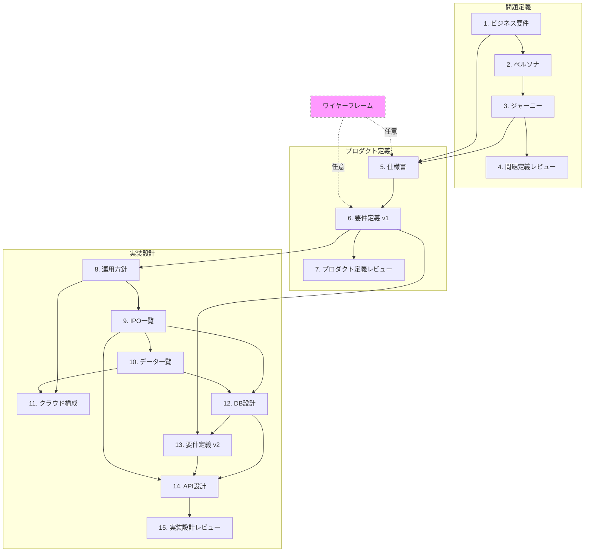

# Design フェーズ ステアリングドキュメント

> このドキュメントは Sprint 3 の設計フェーズ全体を管理するためのガイドです。
> 進捗状況、各ステップの概要、成果物の依存関係を記録します。

---

## 目次

1. [Design フェーズ概要](#design-フェーズ概要)
2. [ワイヤーフレーム（任意・随時実行可）](#ワイヤーフレーム任意随時実行可)
3. [設計フロー全体像](#設計フロー全体像)
4. [各ステップ詳細](#各ステップ詳細)
5. [進捗トラッカー](#進捗トラッカー)
6. [成果物一覧](#成果物一覧)
7. [依存関係図](#依存関係図)

---

## Design フェーズ概要

Design フェーズは、ビジネス要件の整理から API 設計書の完成まで、15 のステップで構成されます。
各ステップには依存関係があり、順序立てて進めることで整合性のある設計ドキュメントを作成できます。

### 3つのフェーズ

| フェーズ | 範囲 | 目的 |
|---------|------|------|
| **問題定義** | ステップ 1〜4 | 誰のどんな問題を解決するかを明確にする |
| **プロダクト定義** | ステップ 5〜7 | 何を作るかを定義する |
| **実装設計** | ステップ 8〜15 | どう作るかを設計する |

---

## ワイヤーフレーム（任意・随時実行可）

### `/design-wireframe` とは

画面遷移と UI のワイヤーフレームを `wireframe/index.html` として作成・更新するコマンドです。

### 特徴

- **任意実行**: 必須ステップではなく、必要に応じて実行
- **何度でも実行可能**: 設計が進むたびに更新してOK
- **依存関係なし**: どのタイミングでも実行できる
- **視覚的確認**: HTML形式でブラウザで確認可能

### 使いどころ

| タイミング | 目的 |
|-----------|------|
| 設計開始前 | アイデアの視覚化、チーム内認識合わせ |
| ステップ 3（ジャーニー）後 | ユーザーフローの具体化 |
| ステップ 5（仕様書）作成時 | 画面構成の検討 |
| ステップ 6（要件定義 v1）作成時 | UI 要素の洗い出し |
| レビュー時 | ステークホルダーへの説明資料 |

### 実行方法

```
/design-wireframe
```

### 成果物

```
wireframe/
└── index.html    # ブラウザで開いて確認
```

---

## 設計フロー全体像

```
┌─────────────────────────────────────────────────────────────────────┐
│                        問題定義フェーズ                              │
├─────────────────────────────────────────────────────────────────────┤
│  1. ビジネス要件 ──→ 2. ペルソナ ──→ 3. ジャーニー ──→ 4. レビュー   │
└─────────────────────────────────────────────────────────────────────┘
                                    │
                                    ▼
┌─────────────────────────────────────────────────────────────────────┐
│                      プロダクト定義フェーズ                          │
├─────────────────────────────────────────────────────────────────────┤
│         5. 仕様書 ──→ 6. 要件定義 v1 ──→ 7. レビュー                 │
└─────────────────────────────────────────────────────────────────────┘
                                    │
                                    ▼
┌─────────────────────────────────────────────────────────────────────┐
│                        実装設計フェーズ                              │
├─────────────────────────────────────────────────────────────────────┤
│  8. 運用方針 ──→ 9. IPO一覧 ──→ 10. データ一覧                       │
│       │              │               │                              │
│       ▼              ▼               ▼                              │
│  11. クラウド構成 ←─────────────→ 12. DB設計                         │
│                                      │                              │
│                                      ▼                              │
│                    13. 要件定義 v2 ──→ 14. API設計 ──→ 15. レビュー   │
└─────────────────────────────────────────────────────────────────────┘
```

---

## 各ステップ詳細

### 問題定義フェーズ

#### 1. ビジネス要件 `/design-business`

| 項目 | 内容 |
|------|------|
| 目的 | プロジェクトの背景・目的・スコープを明確にする |
| 依存 | なし |
| 成果物 | `business-requirements/business-requirements.md` |
| 主な内容 | プロジェクト背景、ビジネス目標、成功指標、制約条件 |

#### 2. ペルソナ `/design-persona`

| 項目 | 内容 |
|------|------|
| 目的 | ターゲットユーザーを具体的に定義する |
| 依存 | ビジネス要件 |
| 成果物 | `personas/*.md`（複数ファイル） |
| 主な内容 | ユーザー属性、ゴール、ペインポイント、行動パターン |

#### 3. ユーザージャーニー `/design-journey`

| 項目 | 内容 |
|------|------|
| 目的 | ユーザーの体験フローを可視化する |
| 依存 | ペルソナ |
| 成果物 | `journey/journey.md` |
| 主な内容 | フェーズ、タッチポイント、感情曲線、機会領域 |

#### 4. 問題定義レビュー `/design-problem-check`

| 項目 | 内容 |
|------|------|
| 目的 | 問題定義フェーズの整合性を確認する |
| 依存 | ユーザージャーニー |
| 成果物 | レビュー結果（口頭またはコメント） |
| チェック項目 | ビジネス目標とペルソナの整合性、ジャーニーの網羅性 |

---

### プロダクト定義フェーズ

#### 5. 仕様書 `/design-spec`

| 項目 | 内容 |
|------|------|
| 目的 | 画面構成と機能を定義する |
| 依存 | ユーザージャーニー、ビジネス要件 |
| 成果物 | `specifications/*.md`、`specifications/flow.md` |
| 主な内容 | ページリスト、画面遷移図、各画面の機能概要 |

#### 6. 要件定義書 v1 `/design-requirements`

| 項目 | 内容 |
|------|------|
| 目的 | 各ページの詳細要件を定義する |
| 依存 | 仕様書 |
| 成果物 | `requirements-v1/*.md`（ページ毎） |
| 主な内容 | 機能要件、UI要素、バリデーション、状態遷移 |

#### 7. プロダクト定義レビュー `/design-product-check`

| 項目 | 内容 |
|------|------|
| 目的 | プロダクト定義フェーズの整合性を確認する |
| 依存 | 要件定義書 v1（全ページ） |
| 成果物 | レビュー結果 |
| チェック項目 | 機能の網羅性、画面遷移の整合性、優先度の妥当性 |

---

### 実装設計フェーズ

#### 8. 運用方針定義 `/design-operations`

| 項目 | 内容 |
|------|------|
| 目的 | 開発・運用体制を定義する |
| 依存 | 要件定義書 v1（全ページ） |
| 成果物 | `operations/operations-policy.md` |
| 主な内容 | チーム構成、ブランチ戦略、クラウド選定、リリースフロー |

#### 9. IPO一覧 `/design-ipo`

| 項目 | 内容 |
|------|------|
| 目的 | 全機能の Input/Process/Output を整理する |
| 依存 | 運用方針定義 |
| 成果物 | `ipo/ipo.md` |
| 主な内容 | 機能一覧、入力項目、処理内容、出力項目 |

#### 10. データ一覧 `/design-data`

| 項目 | 内容 |
|------|------|
| 目的 | システム全体のデータ項目を整理する |
| 依存 | IPO一覧 |
| 成果物 | `data/data-list.md` |
| 主な内容 | エンティティ一覧、属性、データ型、制約 |

#### 11. クラウド構成図 `/design-cloud`

| 項目 | 内容 |
|------|------|
| 目的 | インフラ構成を設計する |
| 依存 | 運用方針定義、データ一覧 |
| 成果物 | `cloud/cloud-diagram.drawio` |
| 主な内容 | AWS/GCP/Azure構成、ネットワーク、セキュリティ |

#### 12. DB設計書 `/design-db`

| 項目 | 内容 |
|------|------|
| 目的 | データベース構造を設計する |
| 依存 | IPO一覧、データ一覧 |
| 成果物 | `database/database-design.md` |
| 主な内容 | ER図、テーブル定義、インデックス、制約 |

#### 13. 要件定義書 v2 `/design-requirements-v2`

| 項目 | 内容 |
|------|------|
| 目的 | DB設計を反映した詳細要件を定義する |
| 依存 | DB設計書、要件定義書 v1 |
| 成果物 | `requirements-v2/*.md`（ページ毎） |
| 主な内容 | データバインディング、エラーハンドリング、非機能要件 |

#### 14. API設計書 `/design-api`

| 項目 | 内容 |
|------|------|
| 目的 | API エンドポイントを設計する |
| 依存 | DB設計書、要件定義書 v2、IPO一覧 |
| 成果物 | `api/api-design.md` |
| 主な内容 | エンドポイント一覧、リクエスト/レスポンス、認証 |

#### 15. 実装設計レビュー `/design-implementation-check`

| 項目 | 内容 |
|------|------|
| 目的 | 実装設計フェーズの整合性を確認する |
| 依存 | API設計書 |
| 成果物 | レビュー結果 |
| チェック項目 | DB-API整合性、セキュリティ、パフォーマンス考慮 |

---

## 進捗トラッカー

> 各ステップ完了時にステータスを更新してください。

| # | ステップ | ステータス | 完了日 | 備考 |
|---|---------|----------|-------|------|
| - | ワイヤーフレーム | ⬜ 未実行 | - | 任意・随時実行可 |
| 1 | ビジネス要件 | ✅ 完了 | 2026-03-15 | 個別指導塾の時間割作成効率化 |
| 2 | ペルソナ | ✅ 完了 | 2026-03-15 | 教室長ペルソナ1名 |
| 3 | ユーザージャーニー | ✅ 完了 | 2026-03-15 | 教室長のジャーニーマップ |
| 4 | 問題定義レビュー | ⬜ 未着手 | - | |
| 5 | 仕様書 | ⬜ 未着手 | - | |
| 6 | 要件定義書 v1 | ⬜ 未着手 | - | |
| 7 | プロダクト定義レビュー | ⬜ 未着手 | - | |
| 8 | 運用方針定義 | ⬜ 未着手 | - | |
| 9 | IPO一覧 | ⬜ 未着手 | - | |
| 10 | データ一覧 | ⬜ 未着手 | - | |
| 11 | クラウド構成図 | ⬜ 未着手 | - | |
| 12 | DB設計書 | ⬜ 未着手 | - | |
| 13 | 要件定義書 v2 | ⬜ 未着手 | - | |
| 14 | API設計書 | ⬜ 未着手 | - | |
| 15 | 実装設計レビュー | ⬜ 未着手 | - | |

### ステータス凡例

- ⬜ 未着手
- 🔄 進行中
- ✅ 完了
- ⏸️ 保留

---

## 成果物一覧

```
docs/requirements/
├── STEERING.md                          # このドキュメント
├── business-requirements/
│   └── business-requirements.md         # ビジネス要件
├── personas/
│   ├── persona-1.md                     # ペルソナ 1
│   ├── persona-2.md                     # ペルソナ 2
│   └── ...
├── journey/
│   └── journey.md                       # ユーザージャーニー
├── specifications/
│   ├── flow.md                          # 画面遷移図・ページリスト
│   ├── page-xxx.md                      # 各ページ仕様
│   └── ...
├── requirements-v1/
│   ├── page-xxx.md                      # 各ページ要件 v1
│   └── ...
├── operations/
│   └── operations-policy.md             # 運用方針
├── ipo/
│   └── ipo.md                           # IPO一覧
├── data/
│   └── data-list.md                     # データ項目一覧
├── cloud/
│   └── cloud-diagram.drawio             # クラウド構成図
├── database/
│   └── database-design.md               # DB設計書
├── requirements-v2/
│   ├── page-xxx.md                      # 各ページ要件 v2
│   └── ...
└── api/
    └── api-design.md                    # API設計書

wireframe/                               # ワイヤーフレーム（任意）
└── index.html
```

---

## 依存関係図



---

## クイックリファレンス

### コマンド一覧

| コマンド | 説明 |
|---------|------|
| `/r2b-design-sprint3` | 設計フェーズの進捗確認・誘導 |
| `/design-wireframe` | ワイヤーフレーム作成（任意・随時） |
| `/design-business` | ビジネス要件の作成 |
| `/design-persona` | ペルソナの定義 |
| `/design-journey` | ユーザージャーニーの作成 |
| `/design-problem-check` | 問題定義フェーズのレビュー |
| `/design-spec` | 仕様書の作成 |
| `/design-requirements` | 要件定義書 v1 の作成 |
| `/design-product-check` | プロダクト定義フェーズのレビュー |
| `/design-operations` | 運用方針の定義 |
| `/design-ipo` | IPO一覧の作成 |
| `/design-data` | データ項目一覧の作成 |
| `/design-cloud` | クラウド構成図の作成 |
| `/design-db` | DB設計書の作成 |
| `/design-requirements-v2` | 要件定義書 v2 の作成 |
| `/design-api` | API設計書の作成 |
| `/design-implementation-check` | 実装設計フェーズのレビュー |

---

## 更新履歴

| 日付 | 更新内容 |
|------|---------|
| 2026-03-06 | 初版作成 |
