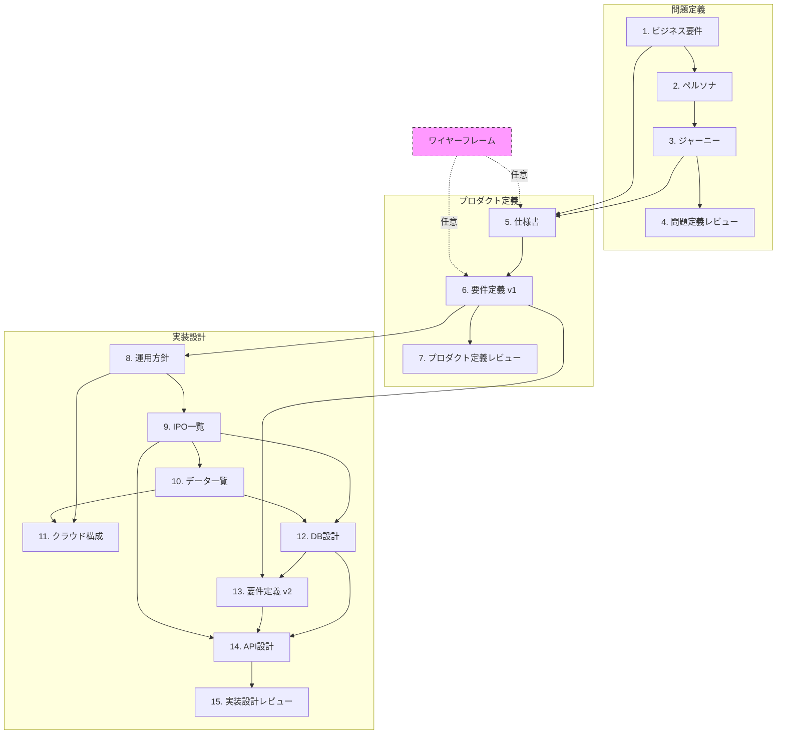

# Sprint 3 ステアリングドキュメント

> このドキュメントは Sprint 3 全体を管理するためのガイドです。
> Design フェーズと Build フェーズの進捗状況、各ステップの概要、成果物の依存関係を記録します。

---

## 目次

### Design フェーズ
1. [Design フェーズ概要](#design-フェーズ概要)
2. [ワイヤーフレーム（任意・随時実行可）](#ワイヤーフレーム任意随時実行可)
3. [設計フロー全体像](#設計フロー全体像)
4. [各ステップ詳細](#各ステップ詳細)
5. [Design 進捗トラッカー](#design-進捗トラッカー)
6. [成果物一覧](#成果物一覧)
7. [依存関係図](#依存関係図)

### Build フェーズ
8. [Build フェーズ概要](#build-フェーズ概要)
9. [Foundation Phase](#foundation-phase)
10. [Feature Slices](#feature-slices)
11. [Build 進捗トラッカー](#build-進捗トラッカー)

---

## Design フェーズ概要

Design フェーズは、ビジネス要件の整理から API 設計書の完成まで、15 のステップで構成されます。
各ステップには依存関係があり、順序立てて進めることで整合性のある設計ドキュメントを作成できます。

### 3つのフェーズ


| フェーズ        | 範囲        | 目的                  |
| ----------- | --------- | ------------------- |
| **問題定義**    | ステップ 1〜4  | 誰のどんな問題を解決するかを明確にする |
| **プロダクト定義** | ステップ 5〜7  | 何を作るかを定義する          |
| **実装設計**    | ステップ 8〜15 | どう作るかを設計する          |


---

## ワイヤーフレーム（任意・随時実行可）

### `/design-wireframe` とは

画面遷移と UI のワイヤーフレームを `wireframe/index.html` として作成・更新するコマンドです。

### 特徴

- **任意実行**: 必須ステップではなく、必要に応じて実行
- **何度でも実行可能**: 設計が進むたびに更新してOK
- **依存関係なし**: どのタイミングでも実行できる
- **視覚的確認**: HTML形式でブラウザで確認可能

### 使いどころ


| タイミング              | 目的                 |
| ------------------ | ------------------ |
| 設計開始前              | アイデアの視覚化、チーム内認識合わせ |
| ステップ 3（ジャーニー）後     | ユーザーフローの具体化        |
| ステップ 5（仕様書）作成時     | 画面構成の検討            |
| ステップ 6（要件定義 v1）作成時 | UI 要素の洗い出し         |
| レビュー時              | ステークホルダーへの説明資料     |


### 実行方法

```
/design-wireframe
```

### 成果物

```
wireframe/
└── index.html    # ブラウザで開いて確認
```

---

## 設計フロー全体像

```
┌─────────────────────────────────────────────────────────────────────┐
│                        問題定義フェーズ                              │
├─────────────────────────────────────────────────────────────────────┤
│  1. ビジネス要件 ──→ 2. ペルソナ ──→ 3. ジャーニー ──→ 4. レビュー   │
└─────────────────────────────────────────────────────────────────────┘
                                    │
                                    ▼
┌─────────────────────────────────────────────────────────────────────┐
│                      プロダクト定義フェーズ                          │
├─────────────────────────────────────────────────────────────────────┤
│         5. 仕様書 ──→ 6. 要件定義 v1 ──→ 7. レビュー                 │
└─────────────────────────────────────────────────────────────────────┘
                                    │
                                    ▼
┌─────────────────────────────────────────────────────────────────────┐
│                        実装設計フェーズ                              │
├─────────────────────────────────────────────────────────────────────┤
│  8. 運用方針 ──→ 9. IPO一覧 ──→ 10. データ一覧                       │
│       │              │               │                              │
│       ▼              ▼               ▼                              │
│  11. クラウド構成 ←─────────────→ 12. DB設計                         │
│                                      │                              │
│                                      ▼                              │
│                    13. 要件定義 v2 ──→ 14. API設計 ──→ 15. レビュー   │
└─────────────────────────────────────────────────────────────────────┘
```

---

## 各ステップ詳細

### 問題定義フェーズ

#### 1. ビジネス要件 `/design-business`


| 項目   | 内容                                               |
| ---- | ------------------------------------------------ |
| 目的   | プロジェクトの背景・目的・スコープを明確にする                          |
| 依存   | なし                                               |
| 成果物  | `business-requirements/business-requirements.md` |
| 主な内容 | プロジェクト背景、ビジネス目標、成功指標、制約条件                        |


#### 2. ペルソナ `/design-persona`


| 項目   | 内容                        |
| ---- | ------------------------- |
| 目的   | ターゲットユーザーを具体的に定義する        |
| 依存   | ビジネス要件                    |
| 成果物  | `personas/*.md`（複数ファイル）   |
| 主な内容 | ユーザー属性、ゴール、ペインポイント、行動パターン |


#### 3. ユーザージャーニー `/design-journey`


| 項目   | 内容                     |
| ---- | ---------------------- |
| 目的   | ユーザーの体験フローを可視化する       |
| 依存   | ペルソナ                   |
| 成果物  | `journey/journey.md`   |
| 主な内容 | フェーズ、タッチポイント、感情曲線、機会領域 |


#### 4. 問題定義レビュー `/design-problem-check`


| 項目     | 内容                        |
| ------ | ------------------------- |
| 目的     | 問題定義フェーズの整合性を確認する         |
| 依存     | ユーザージャーニー                 |
| 成果物    | レビュー結果（口頭またはコメント）         |
| チェック項目 | ビジネス目標とペルソナの整合性、ジャーニーの網羅性 |


---

### プロダクト定義フェーズ

#### 5. 仕様書 `/design-spec`


| 項目   | 内容                                             |
| ---- | ---------------------------------------------- |
| 目的   | 画面構成と機能を定義する                                   |
| 依存   | ユーザージャーニー、ビジネス要件                               |
| 成果物  | `specifications/*.md`、`specifications/flow.md` |
| 主な内容 | ページリスト、画面遷移図、各画面の機能概要                          |


#### 6. 要件定義書 v1 `/design-requirements`


| 項目   | 内容                           |
| ---- | ---------------------------- |
| 目的   | 各ページの詳細要件を定義する               |
| 依存   | 仕様書                          |
| 成果物  | `requirements-v1/*.md`（ページ毎） |
| 主な内容 | 機能要件、UI要素、バリデーション、状態遷移       |


#### 7. プロダクト定義レビュー `/design-product-check`


| 項目     | 内容                      |
| ------ | ----------------------- |
| 目的     | プロダクト定義フェーズの整合性を確認する    |
| 依存     | 要件定義書 v1（全ページ）          |
| 成果物    | レビュー結果                  |
| チェック項目 | 機能の網羅性、画面遷移の整合性、優先度の妥当性 |


---

### 実装設計フェーズ

#### 8. 運用方針定義 `/design-operations`


| 項目   | 内容                                |
| ---- | --------------------------------- |
| 目的   | 開発・運用体制を定義する                      |
| 依存   | 要件定義書 v1（全ページ）                    |
| 成果物  | `operations/operations-policy.md` |
| 主な内容 | チーム構成、ブランチ戦略、クラウド選定、リリースフロー       |


#### 9. IPO一覧 `/design-ipo`


| 項目   | 内容                              |
| ---- | ------------------------------- |
| 目的   | 全機能の Input/Process/Output を整理する |
| 依存   | 運用方針定義                          |
| 成果物  | `ipo/ipo.md`                    |
| 主な内容 | 機能一覧、入力項目、処理内容、出力項目             |


#### 10. データ一覧 `/design-data`


| 項目   | 内容                       |
| ---- | ------------------------ |
| 目的   | システム全体のデータ項目を整理する        |
| 依存   | IPO一覧                    |
| 成果物  | `data-list/data-list.md` |
| 主な内容 | エンティティ一覧、属性、データ型、制約      |


#### 11. クラウド構成図 `/design-cloud`


| 項目   | 内容                            |
| ---- | ----------------------------- |
| 目的   | インフラ構成を設計する                   |
| 依存   | 運用方針定義、データ一覧                  |
| 成果物  | `cloud/cloud-architecture.md`  |
| 主な内容 | AWS構成、VPC設計、ECS/RDS/Redis、セキュリティ、監視、DR |


#### 12. DB設計書 `/design-db`


| 項目   | 内容                            |
| ---- | ----------------------------- |
| 目的   | データベース構造を設計する                 |
| 依存   | IPO一覧、データ一覧                   |
| 成果物  | `database/database-design.md` |
| 主な内容 | ER図、テーブル定義、インデックス、制約          |


#### 13. 要件定義書 v2 `/design-requirements-v2`


| 項目   | 内容                           |
| ---- | ---------------------------- |
| 目的   | DB設計を反映した詳細要件を定義する           |
| 依存   | DB設計書、要件定義書 v1               |
| 成果物  | `requirements-v2/*.md`（ページ毎） |
| 主な内容 | データバインディング、エラーハンドリング、非機能要件   |


#### 14. API設計書 `/design-api`


| 項目   | 内容                       |
| ---- | ------------------------ |
| 目的   | API エンドポイントを設計する         |
| 依存   | DB設計書、要件定義書 v2、IPO一覧     |
| 成果物  | `api/api-design.md`      |
| 主な内容 | エンドポイント一覧、リクエスト/レスポンス、認証 |


#### 15. 実装設計レビュー `/design-implementation-check`


| 項目     | 内容                         |
| ------ | -------------------------- |
| 目的     | 実装設計フェーズの整合性を確認する          |
| 依存     | API設計書                     |
| 成果物    | レビュー結果                     |
| チェック項目 | DB-API整合性、セキュリティ、パフォーマンス考慮 |


---

## 進捗トラッカー

> 各ステップ完了時にステータスを更新してください。


| #   | ステップ        | ステータス | 完了日        | 備考                                                             |
| --- | ----------- | ----- | ---------- | -------------------------------------------------------------- |
| -   | ワイヤーフレーム    | ✅ 完了  | 2026-03-18 | wireframe/index.html                                           |
| 1   | ビジネス要件      | ✅ 完了  | 2026-03-15 | 個別指導塾の時間割作成効率化                                                 |
| 2   | ペルソナ        | ✅ 完了  | 2026-03-15 | 教室長・エリアマネジャー・システム管理者の3名                                        |
| 3   | ユーザージャーニー   | ✅ 完了  | 2026-03-15 | 教室長のジャーニーマップ                                                   |
| 4   | 問題定義レビュー    | ✅ 完了  | 2026-03-15 | ビジネス要件・ペルソナ・ジャーニーの整合性確認済み                                      |
| 5   | 仕様書         | ✅ 完了  | 2026-03-17 | P001〜P013の13画面 + flow.md                                       |
| 6   | 要件定義書 v1    | ✅ 完了  | 2026-03-18 | functional-requirements.md（69機能定義）                             |
| 7   | プロダクト定義レビュー | ✅ 完了  | 2026-03-21 | P008仕様書更新、journey.md更新、P003ドリルダウン追加、P007参照明確化                  |
| 8   | 運用方針定義      | ✅ 完了  | 2026-03-21 | operations/operations-policy.md（12章構成）                        |
| 9   | IPO一覧       | ✅ 完了  | 2026-03-22 | ipo/ipo.md（F001〜F123、共通処理、外部連携）                  |
| 10  | データ一覧       | ✅ 完了  | 2026-03-24 | data-list/data-list.md（29エンティティ、27ENUM、27科目、整合性検証完了）        |
| 11  | クラウド構成図     | ✅ 完了  | 2026-03-23 | cloud/cloud-architecture.md（VPC設計、ECS/RDS/Redis、セキュリティ、監視、DR）        |
| 12  | DB設計書       | ✅ 完了  | 2026-03-24 | database/database-design.md（29テーブル、ER図、ENUM、インデックス、整合性検証完了）                                                                |
| 13  | 要件定義書 v2    | ✅ 完了  | 2026-03-25 | requirements-v2/*.md（15画面+共通機能、DB設計・IPO整合性検証完了）               |
| 14  | API設計書      | ✅ 完了  | 2026-03-25 | api/api-design.md（81エンドポイント、14カテゴリ、認証・共通パターン・エラーコード定義）        |
| 15  | 実装設計レビュー    | ⬜ 未着手 | -          |                                                                |


### ステータス凡例

- ⬜ 未着手
- 🔄 進行中
- ✅ 完了
- ⏸️ 保留

---

## 成果物一覧

```
docs/requirements/
├── STEERING.md                          # このドキュメント
├── business-requirements/
│   └── business-requirements.md         # ビジネス要件
├── personas/
│   ├── persona-1.md                     # ペルソナ 1
│   ├── persona-2.md                     # ペルソナ 2
│   └── ...
├── journey/
│   └── journey.md                       # ユーザージャーニー
├── specifications/
│   ├── flow.md                          # 画面遷移図・ページリスト
│   ├── page-xxx.md                      # 各ページ仕様
│   └── ...
├── requirements-v1/
│   ├── page-xxx.md                      # 各ページ要件 v1
│   └── ...
├── operations/
│   └── operations-policy.md             # 運用方針
├── ipo/
│   └── ipo.md                           # IPO一覧
├── data-list/
│   └── data-list.md                     # データ項目一覧
├── cloud/
│   └── cloud-architecture.md            # クラウド構成図
├── database/
│   └── database-design.md               # DB設計書
├── requirements-v2/
│   ├── page-xxx.md                      # 各ページ要件 v2
│   └── ...
└── api/
    └── api-design.md                    # API設計書

wireframe/                               # ワイヤーフレーム（任意）
└── index.html
```

---

## 依存関係図




---

## Build フェーズ概要

Build フェーズは、Design フェーズで作成した設計ドキュメントを元に実際のシステムを構築します。
**Foundation Phase** と **Feature Slices** の2つのフェーズで構成されます。

### 2つのフェーズ

| フェーズ | 範囲 | 目的 |
|---------|------|------|
| **Foundation Phase** | Slice 0-1〜0-7 | 開発基盤の構築（環境、認証、DB、IaC） |
| **Feature Slices** | Slice 1〜N | 機能単位での垂直スライス実装 |

### アーキテクチャ

```
┌─────────────────────────────────────────────────────────────────────┐
│                           Frontend                                  │
│                    Next.js 14+ (App Router)                        │
│         TypeScript / TailwindCSS / React Query / Zustand           │
└─────────────────────────────────────────────────────────────────────┘
                                   │
                                   ▼
┌─────────────────────────────────────────────────────────────────────┐
│                            Backend                                  │
│                    FastAPI (Python 3.11+)                          │
│              3層アーキテクチャ: API → Service → Repository           │
└─────────────────────────────────────────────────────────────────────┘
                                   │
                                   ▼
┌─────────────────────────────────────────────────────────────────────┐
│                           Database                                  │
│                   PostgreSQL 16 + Redis                            │
│               SQLAlchemy + Alembic Migrations                      │
└─────────────────────────────────────────────────────────────────────┘
```

---

## Foundation Phase

Foundation Phase は開発基盤を構築するフェーズです。
すべての Feature Slice の前提条件となります。

### Slice 一覧

| Slice | 名称 | 目的 | 主な成果物 |
|-------|------|------|-----------|
| 0-1 | Dev Environment | ローカル開発環境の構築 | Docker Compose, .env, Makefile |
| 0-2 | Backend Scaffolding | バックエンド基盤の構築 | FastAPI プロジェクト構造, 3層アーキテクチャ |
| 0-3 | Database Implementation | DB設計の実装 | SQLAlchemy ORM モデル, Alembic マイグレーション |
| 0-4 | Authentication | 認証基盤の実装 | JWT認証, ログイン/ログアウト, パスワード管理 |
| 0-5 | Frontend Setup | フロントエンド基盤の構築 | Next.js プロジェクト, 共通コンポーネント |
| 0-6 | API Integration | API連携基盤の実装 | API クライアント, エラーハンドリング |
| 0-7 | Infrastructure as Code | AWS IaC の構築 | Terraform モジュール, CI/CD パイプライン |

### Slice 0-1: Dev Environment

| 項目 | 内容 |
|------|------|
| 目的 | ローカル開発環境をDocker Composeで構築 |
| 依存 | なし |
| 成果物 | `docker-compose.yml`, `.env.example`, `Makefile` |
| 主な内容 | PostgreSQL 16-alpine, Redis, Backend/Frontend コンテナ定義 |

### Slice 0-2: Backend Scaffolding

| 項目 | 内容 |
|------|------|
| 目的 | FastAPI プロジェクトの基盤構築 |
| 依存 | Slice 0-1 |
| 成果物 | `backend/app/` ディレクトリ構造 |
| 主な内容 | 3層アーキテクチャ（API → Service → Repository）, 設定管理, DB接続 |

**ディレクトリ構造:**
```
backend/
├── app/
│   ├── api/v1/           # APIエンドポイント
│   ├── core/             # 設定、セキュリティ、DB接続
│   ├── models/           # SQLAlchemy ORM モデル
│   ├── repositories/     # データアクセス層
│   ├── schemas/          # Pydantic スキーマ
│   └── services/         # ビジネスロジック層
├── alembic/              # DBマイグレーション
├── scripts/              # ユーティリティスクリプト
└── tests/                # テストコード
```

### Slice 0-3: Database Implementation

| 項目 | 内容 |
|------|------|
| 目的 | DB設計書（29テーブル）をSQLAlchemyモデルとして実装 |
| 依存 | Slice 0-2, DB設計書 |
| 成果物 | `app/models/*.py`, Alembic マイグレーション |
| 主な内容 | 29テーブルのORMモデル, 33 ENUM型, 初期マイグレーション, シードデータ |

**モデルファイル構成:**
- `enums.py` - 33のENUM型定義
- `users.py` - User, PasswordResetToken, RefreshToken
- `classrooms.py` - Area, Classroom, ClassroomSettings, TimeSlot, GoogleFormConnection, UserClassroom, UserArea
- `teachers.py` - Teacher（バージョン管理）, TeacherSubject, TeacherGrade
- `students.py` - Student（バージョン管理）, StudentSubject
- `subjects.py` - Subject, NgRelation
- `preferences.py` - TeacherShiftPreference, StudentPreference
- `schedules.py` - Term, TermConstraint, Policy, PolicyTemplate, Schedule, ScheduleSlot, Absence, Substitution
- `notifications.py` - Notification, AuditLog

### Slice 0-4: Authentication

| 項目 | 内容 |
|------|------|
| 目的 | P001ログイン画面の要件に基づく認証基盤の実装 |
| 依存 | Slice 0-3, 要件定義書v2 P001 |
| 成果物 | `app/core/auth.py`, `app/services/auth.py`, `app/api/v1/auth.py` |
| 主な内容 | JWT + HttpOnly Cookie認証, bcrypt(cost=12), リフレッシュトークン, パスワードリセット |

**認証フロー:**
```
POST /api/v1/auth/login          → アクセストークン + リフレッシュトークン発行
POST /api/v1/auth/refresh        → アクセストークン再発行
POST /api/v1/auth/logout         → リフレッシュトークン無効化
POST /api/v1/auth/password/change → パスワード変更
POST /api/v1/auth/password-reset/request → リセットトークン発行
POST /api/v1/auth/password-reset/execute → パスワードリセット実行
GET  /api/v1/auth/me             → 現在のユーザー情報取得
```

### Slice 0-5: Frontend Setup

| 項目 | 内容 |
|------|------|
| 目的 | Next.js フロントエンド基盤の構築 |
| 依存 | Slice 0-1 |
| 成果物 | `frontend/` ディレクトリ構造 |
| 主な内容 | Next.js 14 (App Router), TypeScript, TailwindCSS, shadcn/ui |

### Slice 0-6: API Integration

| 項目 | 内容 |
|------|------|
| 目的 | Frontend-Backend API連携基盤の実装 |
| 依存 | Slice 0-4, Slice 0-5 |
| 成果物 | APIクライアント, 認証フック, エラーハンドリング |
| 主な内容 | React Query, Axios interceptors, トークンリフレッシュ |

### Slice 0-7: Infrastructure as Code

| 項目 | 内容 |
|------|------|
| 目的 | AWS インフラをTerraformで構築 |
| 依存 | クラウド構成図 |
| 成果物 | `infrastructure/terraform/` |
| 主な内容 | VPC, ECS Fargate, RDS PostgreSQL, ElastiCache Redis, ALB, CloudFront |

---

## Feature Slices

Feature Slices は機能単位での垂直スライス実装です。
各スライスは Frontend → Backend → Database の全レイヤーを含みます。

### スライス構成（予定）

| Slice | 機能 | 対応画面 | 優先度 |
|-------|------|---------|--------|
| 1 | ログイン・認証 | P001 | 高 |
| 2 | ダッシュボード | P002 | 高 |
| 3 | 教室管理 | P003 | 高 |
| 4 | 講師管理 | P004 | 高 |
| 5 | 生徒管理 | P005 | 高 |
| 6 | 科目管理 | P006 | 中 |
| 7 | 期間設定 | P007 | 中 |
| 8 | 希望登録・集約 | P008 | 高 |
| 9 | 時間割作成 | P009 | 最高 |
| 10 | 時間割確認・調整 | P010 | 高 |
| 11 | 欠席・代講管理 | P011 | 中 |
| 12 | 通知管理 | P012 | 中 |
| 13 | システム設定 | P013 | 低 |

---

## Build 進捗トラッカー

> 各スライス完了時にステータスを更新してください。

### Foundation Phase

| Slice | 名称 | ステータス | 完了日 | 備考 |
|-------|------|----------|--------|------|
| 0-1 | Dev Environment | ✅ 完了 | 2026-03-25 | Docker Compose (PostgreSQL, Redis), Makefile |
| 0-2 | Backend Scaffolding | ✅ 完了 | 2026-03-25 | FastAPI 3層アーキテクチャ, 設定管理 |
| 0-3 | Database Implementation | ✅ 完了 | 2026-03-26 | 29テーブル ORM, マイグレーション, シードデータ |
| 0-4 | Authentication | ✅ 完了 | 2026-03-26 | JWT認証, bcrypt, リフレッシュトークン |
| 0-5 | Frontend Setup | ✅ 完了 | 2026-03-26 | Next.js 14, TailwindCSS, shadcn/ui, App Router |
| 0-6 | API Integration | ✅ 完了 | 2026-03-26 | Axios, React Query, Zustand, 認証フック |
| 0-7 | Infrastructure as Code | ✅ 完了 | 2026-03-26 | Terraform (VPC, ECS, RDS, Redis), 環境別設定 |

### Feature Slices

| Slice | 機能 | ステータス | 完了日 | 備考 |
|-------|------|----------|--------|------|
| 1 | ログイン・認証 | ✅ 完了 | 2026-03-26 | ログイン/ログアウト, パスワード変更/リセット |
| 2 | ダッシュボード | ✅ 完了 | 2026-03-26 | 充足率, ヒートマップ, 科目カバー率, 需給バランス, 通知 |
| 3 | 教室管理 | ⬜ 未着手 | - | |
| 4 | 講師管理 | ⬜ 未着手 | - | |
| 5 | 生徒管理 | ⬜ 未着手 | - | |
| 6 | 科目管理 | ⬜ 未着手 | - | |
| 7 | 期間設定 | ⬜ 未着手 | - | |
| 8 | 希望登録・集約 | ⬜ 未着手 | - | |
| 9 | 時間割作成 | ⬜ 未着手 | - | |
| 10 | 時間割確認・調整 | ⬜ 未着手 | - | |
| 11 | 欠席・代講管理 | ⬜ 未着手 | - | |
| 12 | 通知管理 | ⬜ 未着手 | - | |
| 13 | システム設定 | ⬜ 未着手 | - | |

### ステータス凡例

- ⬜ 未着手
- 🔄 進行中
- ✅ 完了
- ⏸️ 保留

---

## クイックリファレンス

### コマンド一覧


| コマンド                           | 説明                |
| ------------------------------ | ----------------- |
| `/r2b-design-sprint3`          | 設計フェーズの進捗確認・誘導    |
| `/design-wireframe`            | ワイヤーフレーム作成（任意・随時） |
| `/design-business`             | ビジネス要件の作成         |
| `/design-persona`              | ペルソナの定義           |
| `/design-journey`              | ユーザージャーニーの作成      |
| `/design-problem-check`        | 問題定義フェーズのレビュー     |
| `/design-spec`                 | 仕様書の作成            |
| `/design-requirements`         | 要件定義書 v1 の作成      |
| `/design-product-check`        | プロダクト定義フェーズのレビュー  |
| `/design-operations`           | 運用方針の定義           |
| `/design-ipo`                  | IPO一覧の作成          |
| `/design-data`                 | データ項目一覧の作成        |
| `/design-cloud`                | クラウド構成図の作成        |
| `/design-db`                   | DB設計書の作成          |
| `/design-requirements-v2`      | 要件定義書 v2 の作成      |
| `/design-api`                  | API設計書の作成         |
| `/design-implementation-check` | 実装設計フェーズのレビュー     |


---

## 更新履歴


| 日付         | 更新内容 |
| ---------- | ---- |
| 2026-03-06 | 初版作成 |
| 2026-03-21 | プロダクト定義フェーズ完了（ステップ7）、ステップ8以降の誤記修正 |
| 2026-03-21 | 運用方針定義（ステップ8）完了 |
| 2026-03-22 | IPO一覧（ステップ9）完了 |
| 2026-03-24 | データ一覧（ステップ10）パス修正（data/ → data-list/）、DB設計書（ステップ12）完了、要件定義書v1/IPO/データ一覧/DB設計書の整合性検証完了 |
| 2026-03-25 | 要件定義書v2（ステップ13）完了（15画面+共通機能、DB設計・データ一覧・IPO整合性検証・修正完了）、API設計書（ステップ14）完了（81エンドポイント、14カテゴリ） |
| 2026-03-26 | Buildフェーズ開始。Foundation Phase 完了（Slice 0-1〜0-7: Dev Environment, Backend Scaffolding, Database Implementation, Authentication, Frontend Setup, API Integration, Infrastructure as Code） |
| 2026-03-26 | Feature Slices 1-2 完了（ログイン・認証、ダッシュボード） |


