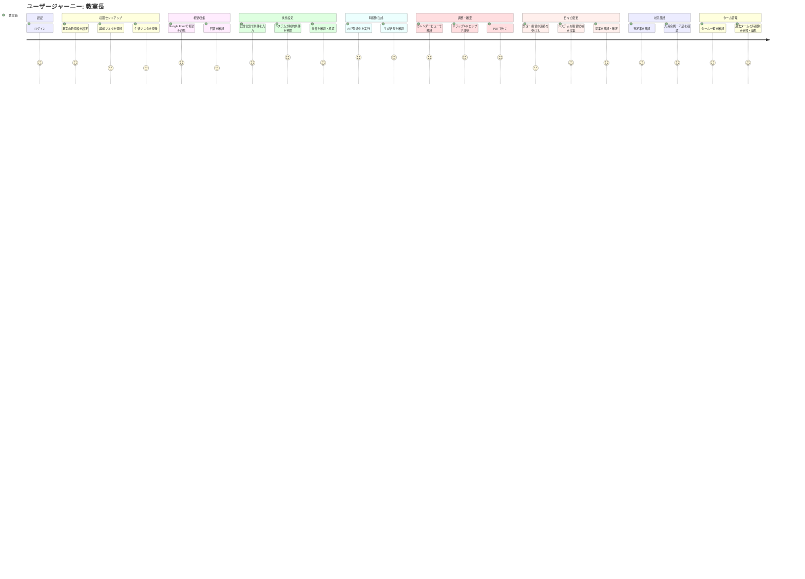
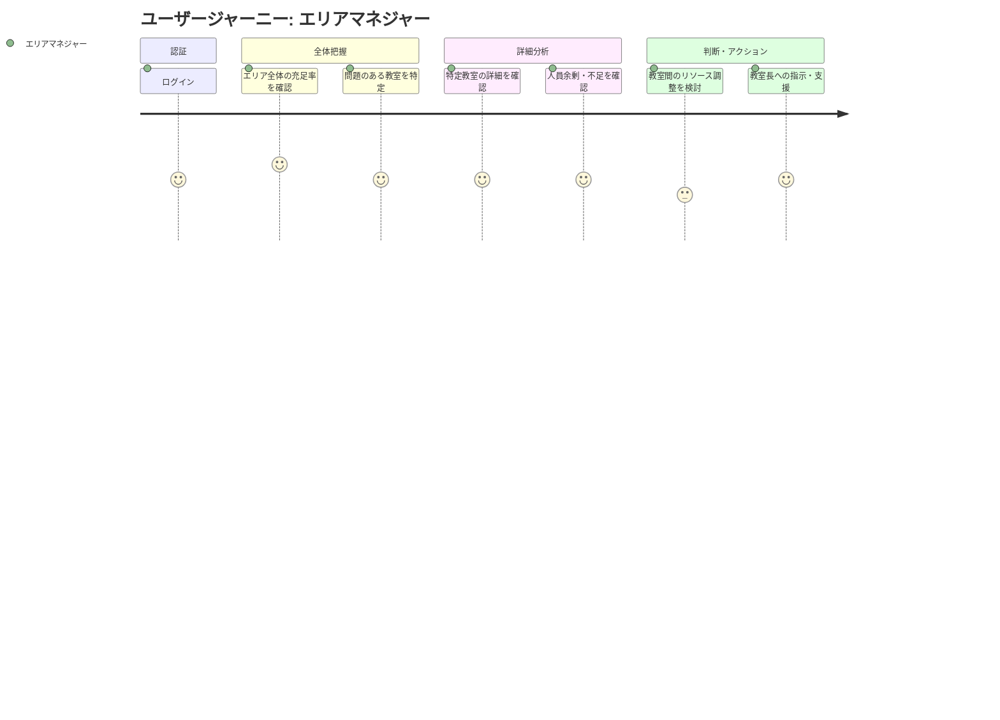
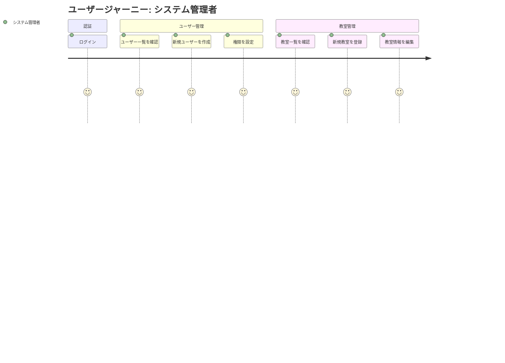

# ユーザージャーニー

---

## 教室長のジャーニー

### ペルソナ

| 項目 | 内容 |
|-----|------|
| ペルソナ | 教室長（田中 優介） |
| ユーザー像 | 20代後半、個別指導塾の教室長。Excel・メールは日常的に使用。 |
| 課題 | 時間割作成に月30時間+毎日2時間。1対1コマが20〜30%発生し収益性低下。 |
| 利用シーン | 月初の時間割作成、日々の欠席・振替対応、充足率確認、ターム管理 |

### ジャーニーマップ

### 初期セットアップフロー

初回利用時または新学期開始時に実施する。

| # | フェーズ | 行動 | 課題・感情 | 解決 |
|---|---------|------|----------|------|
| 0-1 | 認証 | システムにログイン | - | メールアドレス・パスワードで認証 |
| 0-2 | 教室設定 | 時間枠（1限目〜N限目）、曜日、教室のキャパシティを設定 | 設定項目が多いと面倒 | デフォルト設定を用意、変更が必要な箇所のみ編集 |
| 0-3 | 講師登録 | 講師の名前、担当可能科目、基本シフトを登録 | 人数が多いと入力が大変 | CSVインポート機能で一括登録可能 |
| 0-4 | 生徒登録 | 生徒の名前、受講科目、希望講師（あれば）を登録 | 人数が多いと入力が大変 | CSVインポート機能で一括登録可能 |

### メインフロー

| # | フェーズ | 行動 | 課題・感情 | 解決 |
|---|---------|------|----------|------|
| 1 | 希望収集 | Google Formで講師・生徒の希望を収集 | 回答を待つ時間がある | Formで自動集計されるので転記不要 |
| 2 | 条件設定 | 自然言語で時間割の条件を入力 | 条件の整理が難しい | システムが制約条件DBと照合して整理・提示 |
| 3 | 時間割生成 | AIエージェントが遺伝的アルゴリズムで最適化 | 待ち時間がある | 進捗モニタリングで状況把握可能 |
| 4 | 結果確認 | 最適化結果と注意事項を確認 | 問題箇所の把握 | 説明付きで注意点が明示される |
| 5 | 調整 | カレンダービューでドラッグ&ドロップ調整 | 変更可否の判断 | 色で移動の可否を即座にフィードバック |
| 6 | 確定・出力 | 全体・生徒ごと・講師ごとにPDF出力 | 共有の手間 | ワンクリックでPDF出力 |
| 7 | 日々の変更 | 欠席・振替対応 | 振替先の探索 | システムが振替候補を自動提案 |

### 状況確認フロー

| # | フェーズ | 行動 | 課題・感情 | 解決 |
|---|---------|------|----------|------|
| 8-1 | 充足率確認 | 自教室の1対2充足率をダッシュボードで確認 | 数値の把握が難しい | グラフ・数値で視覚的に表示 |
| 8-2 | 人員状況確認 | 講師の余剰・不足状況を確認 | 曜日・時間帯ごとの把握が煩雑 | ヒートマップ形式で一目で把握可能 |

### ターム管理フロー

| # | フェーズ | 行動 | 課題・感情 | 解決 |
|---|---------|------|----------|------|
| 9-1 | ターム一覧確認 | 学期・タームごとの時間割リストを確認 | 過去のタームが探しにくい | リスト形式で時系列に整理 |
| 9-2 | ターム編集 | 特定タームの時間割を選択して編集 | 編集対象の特定が難しい | ターム選択後に時間割調整画面へ遷移 |
| 9-3 | ターム複製 | 過去タームをベースに新タームを作成 | ゼロからの作成は手間 | 既存タームを複製して差分のみ編集 |

### カレンダービューの表示切替

| ビュー | 用途 |
|-------|------|
| 全体ビュー | 教室全体の稼働状況を俯瞰 |
| 生徒ごとビュー | 特定生徒のスケジュール確認 |
| 講師ごとビュー | 特定講師のスケジュール確認 |

### 感情の変化

- **開始時**: 「また時間割作成か...30時間の作業が待っている」（不安・憂鬱）
- **条件設定時**: 「自然言語で伝えるだけで条件を整理してくれるのは楽だ」（安心）
- **生成完了時**: 「自動で最適化してくれた！1対1コマも減っている」（喜び・驚き）
- **調整時**: 「ドラッグするだけで変更できて、色で可否もわかる」（快適）
- **状況確認時**: 「充足率や人員状況が一目でわかる。判断しやすい」（安心）
- **ゴール達成時**: 「PDFもすぐ出せた。本来の仕事に集中できる！」（達成感・解放感）

---

## エリアマネジャーのジャーニー

### ペルソナ

| 項目 | 内容 |
|-----|------|
| ペルソナ | エリアマネジャー（鈴木 真理子） |
| ユーザー像 | 30代後半、5〜8教室を統括。Excel・BIツールは日常的に使用。 |
| 課題 | 各教室のデータが分散しており、エリア全体の状況把握が困難。 |
| 利用シーン | 週次・月次のエリア状況確認、教室間のリソース調整判断 |

### ジャーニーマップ

### メインフロー

| # | フェーズ | 行動 | 課題・感情 | 解決 |
|---|---------|------|----------|------|
| 1 | 認証 | システムにログイン | - | メールアドレス・パスワードで認証 |
| 2 | 全体把握 | エリア全体の充足率サマリーを確認 | 各教室を個別に見るのは手間 | マネジメントダッシュボードで一覧表示 |
| 3 | 問題特定 | 充足率が低い教室、人員に問題がある教室を特定 | 問題の優先度判断が難しい | アラート・ランキング形式で優先度を可視化 |
| 4 | 詳細確認 | 特定教室の詳細データを確認 | 深掘りに時間がかかる | ドリルダウンで詳細画面へ遷移 |
| 5 | 人員分析 | 教室ごとの講師余剰・不足を確認 | 教室間の比較が困難 | 複数教室を並べて比較可能 |
| 6 | 調整判断 | 講師の教室間移動などリソース調整を検討 | 調整の影響範囲が見えにくい | シミュレーション機能（将来対応） |

### 感情の変化

- **開始時**: 「各教室の状況を把握しなければ。でもデータがバラバラで面倒だ」（負担感）
- **全体把握時**: 「一画面でエリア全体が見える。問題のある教室もすぐわかる」（安心・効率感）
- **詳細確認時**: 「ドリルダウンで詳細も見られる。判断材料が揃っている」（自信）
- **アクション時**: 「教室長への支援もしやすくなった。本来のマネジメントに集中できる」（達成感）

---

## システム管理者のジャーニー

### ペルソナ

| 項目 | 内容 |
|-----|------|
| ペルソナ | システム管理者（山田 健一） |
| ユーザー像 | 40代前半、本部情報システム担当。社内システムの管理経験あり。 |
| 課題 | ユーザーアカウントや教室マスタの管理を効率的に行いたい。 |
| 利用シーン | ユーザーアカウント管理、教室マスタ管理、問い合わせ対応 |

### ジャーニーマップ

### メインフロー

| # | フェーズ | 行動 | 課題・感情 | 解決 |
|---|---------|------|----------|------|
| 1 | 認証 | システムにログイン | - | メールアドレス・パスワードで認証 |
| 2 | ユーザー確認 | ユーザー一覧を確認 | 対象ユーザーを探すのが手間 | 検索・フィルター機能で絞り込み |
| 3 | ユーザー作成 | 新規ユーザーを作成、役割・担当教室を設定 | 入力項目が多い | 必須項目を明確化、役割選択で項目を出し分け |
| 4 | 権限設定 | ユーザーの権限（教室長/エリアマネジャー）を設定 | 権限の影響範囲が不明確 | 権限ごとのアクセス範囲を明示 |
| 5 | 教室確認 | 教室一覧を確認 | 対象教室を探すのが手間 | 検索・フィルター機能で絞り込み |
| 6 | 教室登録 | 新規教室を登録、基本情報を入力 | 入力項目が多い | 必須項目を明確化 |
| 7 | 教室編集 | 既存教室の情報を編集 | 変更履歴が追えない | 変更履歴を記録・表示 |

### 感情の変化

- **開始時**: 「また問い合わせが来た。対応しなければ」（日常業務）
- **操作時**: 「一覧から探せるし、操作も直感的でわかりやすい」（安心）
- **完了時**: 「対応完了。次の問い合わせにも備えられる」（達成感）
