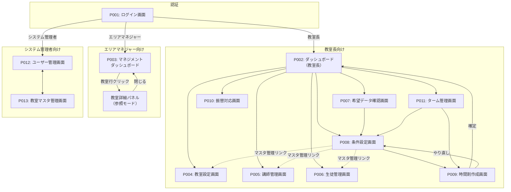
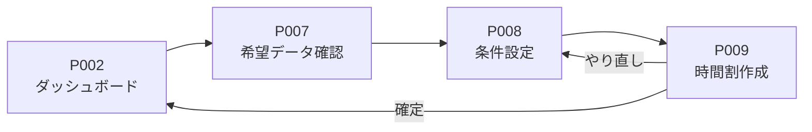
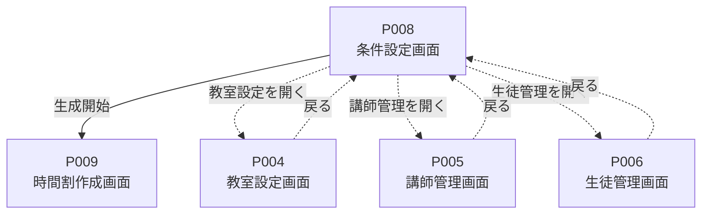
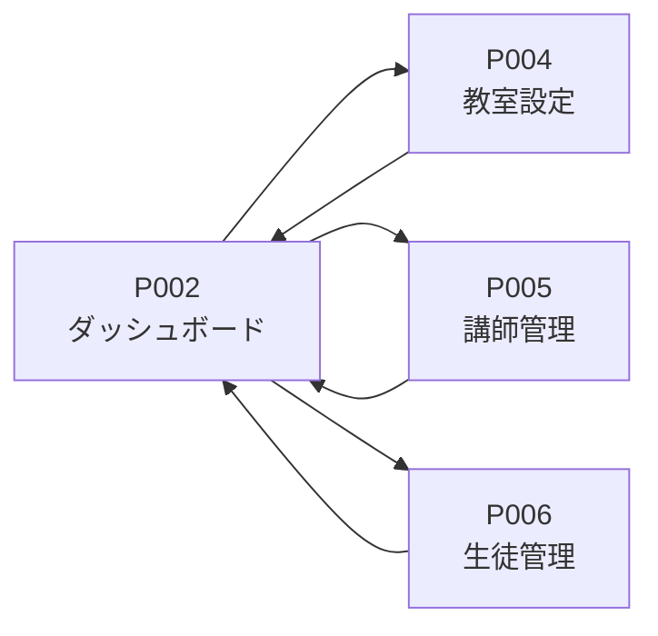
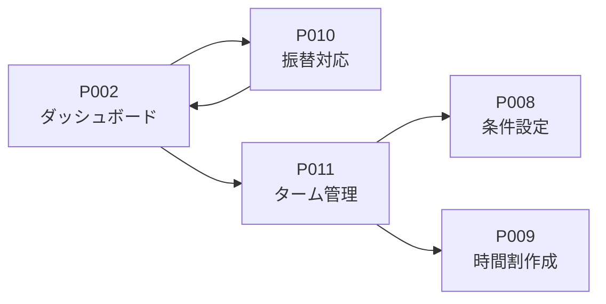
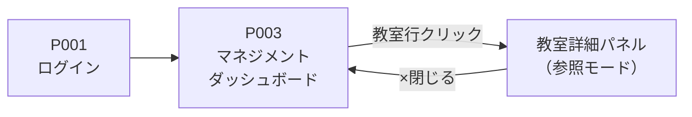

# 画面フロー・遷移図

## 概要

| 項目 | 内容 |
|------|------|
| プロジェクト | 学習塾時間割最適化システム |
| 作成日 | 2026-03-15 |
| 最終更新日 | 2026-03-21 |

## ページリスト（確定版）

| ページID | ページ名 | 対象ユーザー | 説明 |
|---------|---------|-------------|------|
| P001 | ログイン画面 | 共通 | 認証（メール・パスワード）、パスワードリセット |
| P002 | ダッシュボード（教室長） | 教室長 | 充足率・人員状況サマリー、各機能への導線 |
| P003 | マネジメントダッシュボード | エリアマネジャー | エリア全体の充足率・人員一覧、教室詳細ドリルダウン |
| P004 | 教室設定画面 | 教室長 | 時間枠・曜日・キャパシティの設定 |
| P005 | 講師管理画面 | 教室長 | 講師の登録・編集・一覧、CSVインポート |
| P006 | 生徒管理画面 | 教室長 | 生徒の登録・編集・一覧、CSVインポート |
| P007 | 希望データ確認画面 | 教室長 | Google Formから取り込んだ希望データの確認・編集 |
| P008 | 条件設定画面 | 教室長 | ターム選択、マスタ反映確認、ターム調整、全体ポリシー設定 |
| P009 | 時間割作成画面 | 教室長 | AI生成・進捗・結果確認・カレンダー調整・PDF出力 |
| P010 | 振替対応画面 | 教室長 | ターム選択、欠席登録、振替候補提案・確定 |
| P011 | ターム管理画面 | 教室長 | ターム一覧・検索、過去ターム参照、ターム複製 |
| P012 | ユーザー管理画面 | システム管理者 | ユーザーの作成・編集・削除、権限設定 |
| P013 | 教室マスタ管理画面 | システム管理者 | 教室の作成・編集・削除、エリア設定 |

## ページ関係表

### 教室長の画面遷移

| ページ名 | 説明 | 遷移元 | 遷移先 | 遷移トリガー |
|--------|------|--------|--------|------------|
| P001 ログイン画面 | 認証 | - | P002 | ログイン成功 |
| P002 ダッシュボード | ホーム画面 | P001, 各画面 | P004〜P011 | サイドバー、クイックアクション |
| P004 教室設定画面 | 教室設定 | P002, P008 | P002 | 保存/キャンセル |
| P005 講師管理画面 | 講師管理 | P002, P008 | P002 | サイドバー |
| P006 生徒管理画面 | 生徒管理 | P002, P008 | P002 | サイドバー |
| P007 希望データ確認画面 | 希望データ確認 | P002 | P002, P008 | サイドバー、時間割作成へ |
| P008 条件設定画面 | 条件設定 | P002, P007, P011 | P009, P004, P005, P006 | 生成開始、マスタ管理リンク |
| P009 時間割作成画面 | 時間割作成・調整 | P008 | P002, P008 | 確定、やり直し |
| P010 振替対応画面 | 振替対応 | P002 | P002 | サイドバー |
| P011 ターム管理画面 | ターム管理 | P002 | P002, P008, P009 | サイドバー、条件設定、編集 |

### エリアマネジャーの画面遷移

| ページ名 | 説明 | 遷移元 | 遷移先 | 遷移トリガー |
|--------|------|--------|--------|------------|
| P001 ログイン画面 | 認証 | - | P003 | ログイン成功 |
| P003 マネジメントダッシュボード | エリア全体管理 | P001 | 教室詳細パネル（P002相当・参照のみ） | 教室行クリック |

### システム管理者の画面遷移

| ページ名 | 説明 | 遷移元 | 遷移先 | 遷移トリガー |
|--------|------|--------|--------|------------|
| P001 ログイン画面 | 認証 | - | P012 | ログイン成功 |
| P012 ユーザー管理画面 | ユーザー管理 | P001 | P013 | サイドバー |
| P013 教室マスタ管理画面 | 教室管理 | P012 | P012 | サイドバー |

## ページ遷移図

### 全体像

### 教室長のメインフロー（時間割作成）

### P008 条件設定画面の遷移詳細

### 教室長のサブフロー（マスタ管理）

### 教室長のサブフロー（日々の運用）

### エリアマネジャーのフロー

## 補足

- 各ページの詳細仕様は `specifications/P0XX_*.md` を参照
- モーダルやスライドインパネルは遷移図では省略（ただしP003の詳細パネルは明示）
- サイドバーからはダッシュボードおよび主要機能へ常時遷移可能
- P008からマスタ管理画面（P004/P005/P006）へのリンクは「恒久的な設定変更が必要な場合」に使用
- 点線（-.->）は補助的な遷移（メイン導線ではない）を示す
